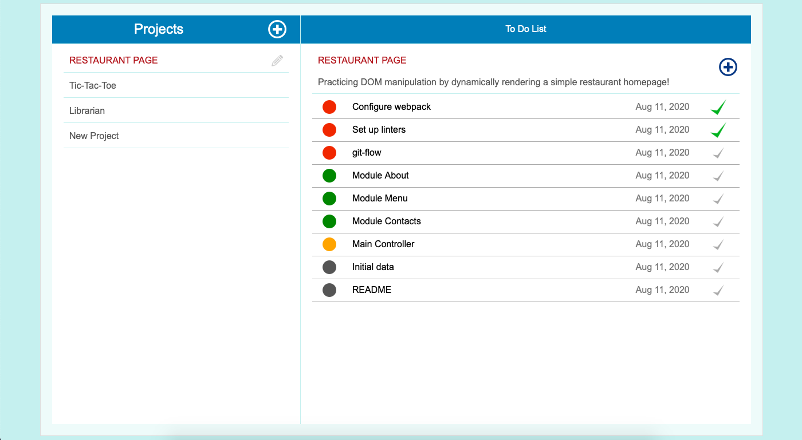
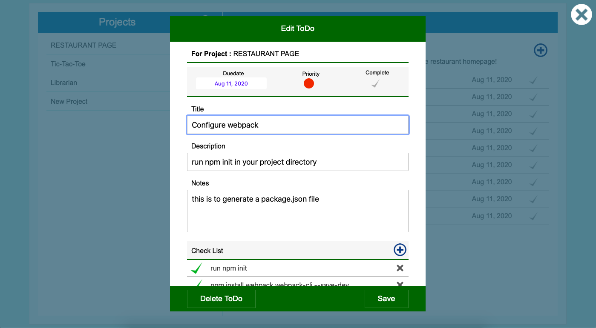

# To Do List

<!--
*** Thanks for checking out this README Template. If you have a suggestion that would
*** make this better, please fork the repo and create a pull request or simply open
*** an issue with the tag "enhancement".
*** Thanks again! Now go create something AMAZING! :D
-->

<!-- PROJECT SHIELDS -->
<!--
*** I'm using markdown "reference style" links for readability.
*** Reference links are enclosed in brackets [ ] instead of parentheses ( ).
*** See the bottom of this document for the declaration of the reference variables
*** for contributors-url, forks-url, etc. This is an optional, concise syntax you may use.
*** https://www.markdownguide.org/basic-syntax/#reference-style-links
-->

[![Contributors][contributors-shield]][contributors-url]
[![Forks][forks-shield]][forks-url]
[![Stargazers][stars-shield]][stars-url]
[![Issues][issues-shield]][issues-url]

<!-- PROJECT LOGO -->
<br />
<p align="center">
  <a href="https://github.com/ioanniskousis/To-Do-List">
    
  </a>
  
  <h3 align="center">The To-Do-List Application</h3>
  
  <p align="center">
    This project is part of the Microverse curriculum in JavaScript course!
    <br />
    <a href="https://github.com/ioanniskousis/To-Do-List"><strong>Explore the docs</strong></a>
    <br />
    <a href="https://ioanniskousis.github.io/To-Do-List/">Live Version</a>
    <br />
    <a href="https://www.loom.com/share/b67ce3cd73904485abea20f409983125">Watch Video</a>
    <br />
    <a href="https://github.com/ioanniskousis/To-Do-List/issues">Report Bug</a>
    <span> - </span>
    <a href="https://github.com/ioanniskousis/To-Do-List/issues">Request Feature</a>
  </p>
</p>

This is a small To-Do-List application where the user can create projects and add a list of tasks to be performed. Each task has its own check list, due date, priority, and notes to keep track of the procedute.

<hr />

<!-- TABLE OF CONTENTS -->

## Table of Contents
- [Video Presentation](#video-presentation)
- [Screen Shots](#screen-shots)
- [About the Project](#about-the-project)
- [Application Instructions](#application-instructions)
- [Live Version](#live-version)
- [System Requierments](#system-requierments)
- [Development](#development)
- [Dependencies](#dependencies)
- [Built With](#built-with)
- [Contributors](#contributors)
- [Acknowledgements](#acknowledgements)

## Video Presentation
  [Watch Video](https://www.loom.com/share/b67ce3cd73904485abea20f409983125)
<hr />

## Screen Shots  

<hr />

<hr />

<hr />
<!-- ABOUT THE PROJECT -->

## About The Project  

  The project follows the MVC principles.  
  The main control is applied in index.js.  
  Partially,  
    - the model for projects is implemented in projectsDB.js for the database and projectClass.js for the project entity.  
    - the model for the todos is implemented in todosDB.js for the database and todoClass.js for the todo entity.  
    - the projects controller role is implemented in projectsController.js  
    - the todos controller in the todosController.js  
    - the projects view is in projectsSideBar.js for the projets index, and projectForm.js for the project new and edit.  
    - the todos view is in the todosView.js for the todos index, and todoForm.js for the todo new and edit.  
  
  Classes are used for entities of project, todo and checkItem for the todos checkList.  
  Modules are constructed for each controller.  

  * Data are percistently saved in localStorage.  
  * An initial population is performed when the localStorage is empty of projects by data held in seed.js.  
  * Shorthand commands for creating and accessing elements are used and are held in utils.js.  

<hr/>

<!-- ABOUT THE PROJECT -->

## Application Instructions  

  - The application comes with some initial data held in seed.js file  
  - Projects stand on the left of the screen. Clicking a project shows the relevant tasks on the right.  
  
  - To add a new project click the plus button at the top of the projects list.  
  
  - In the project edit form add a title and optionally a description and a priority. A high priority shifts the project title to the top.  A second priority factor is the last date it has been edited.  
  - By selecting a project its to-dos appear on the right. Each task shows its priority, title, due date, and completion checkbox.  The completion check can be used in place.  
  
  - Clicking on the title of a task shows the to-do edit form.  
  
  - To add new tasks click the plus button at the top-right of the to-dos list.  
  - Each task allows us to enter a title, a description, a notes field to track the procedure keeping notes, due date, priority, completion checkbox, and a checklist with description.  
  - All entities can be deleted from their relevant edit views.  
  - Since the persistence of data is achieved using the localStorage, all the data inserted or edited are available only on the computer and the particular browser which have been used.  
  
<hr/>

## Live Version

[GitHub Pages](https://ioanniskousis.github.io/To-Do-List/)

<hr/>

## System Requierments

  - JavaScript Enabled  
  - You need to Disable Cross-Origin-Restrictions from your browser if you want to open the index.html from your file system without using a server.  

<hr/>

## Development
  * Clone the project
  ```
    https://github.com/ioanniskousis/To-Do-List.git
    
    Use VSCode and Live Server to show index.html
    Since webpack is used, run 'npm run build' on you terminal before opening
  ``` 
<hr/>

## Dependencies

  please run
  ```
    npm run build
  ```
  to comply with the dependencies held in package.json
<hr/>

## Built With

This project was built using these technologies.

  - JavaScript (ES6)
  - HTML5
  - CSS3
  - webpack
  - date-fns
  - Git - GitHub
  - ESLint
  - Stylelint
  - Stickler

<hr/>

<!-- CONTACT -->

## Contributors

:bust_in_silhouette:
​
## Ioannis Kousis

- Github: [@ioanniskousis](https://github.com/ioanniskousis)
- Twitter: [@ioanniskousis](https://twitter.com/ioanniskousis)
- Linkedin: [Ioannis Kousis](https://www.linkedin.com/in/jgkousis)
- E-mail: jgkousis@gmail.com
​
<hr/>
<!-- ACKNOWLEDGEMENTS -->

## Acknowledgements

  - [Microverse](https://www.microverse.org/)
  - [The Odin Project](https://www.theodinproject.com/)


<!-- MARKDOWN LINKS & IMAGES -->
<!-- https://www.markdownguide.org/basic-syntax/#reference-style-links -->

[contributors-shield]: https://img.shields.io/github/contributors/ioanniskousis/To-Do-List.svg?style=flat-square
[contributors-url]: https://github.com/ioanniskousis/To-Do-List/graphs/contributors
[forks-shield]: https://img.shields.io/github/forks/ioanniskousis/To-Do-List.svg?style=flat-square
[forks-url]: https://github.com/ioanniskousis/To-Do-List/network/members
[stars-shield]: https://img.shields.io/github/stars/ioanniskousis/To-Do-List.svg?style=flat-square
[stars-url]: https://github.com/ioanniskousis/To-Do-List/stargazers
[issues-shield]: https://img.shields.io/github/issues/ioanniskousis/To-Do-List.svg?style=flat-square
[issues-url]: https://github.com/ioanniskousis/To-Do-List/issues

